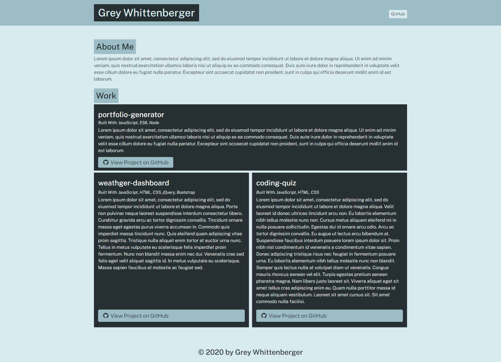

# Portfolio Generator

## How to use
<ol>
<li>Download the repo to your machine and use node to run app.js</li>
<li>You will then be prompted by a series of questions that will dictate how to portfolio is structured and what projects it will include.</li>
<li>To see the output look in ./dist</li>
</ol>

There is an example output that was generated by the program provided in the dist file.

